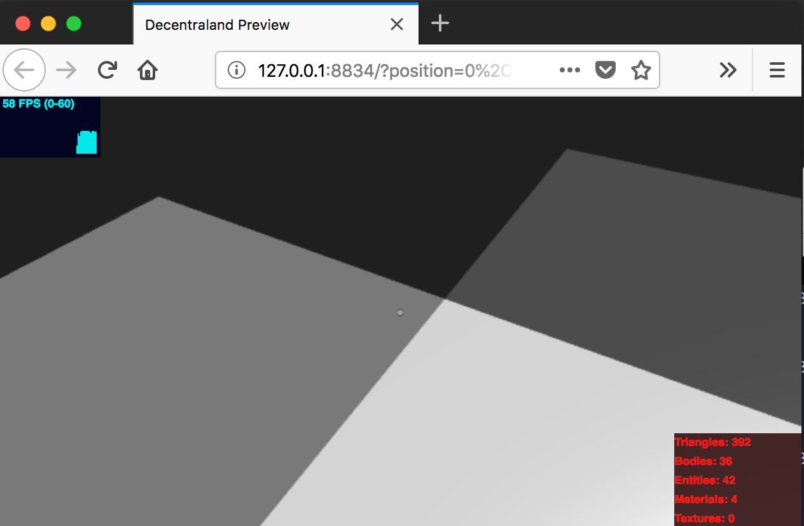
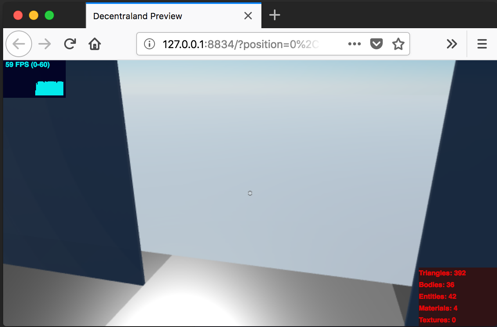
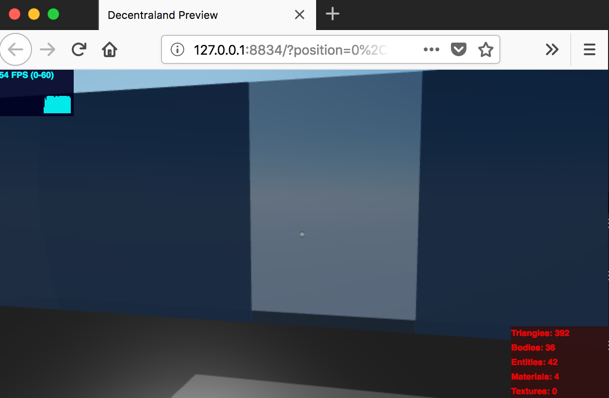

# sample-sync-websockets: Proximity Activation

In the [Synchronize Websockets](./synchronize-websockets.md) doc we go over how to track some Decentraland events called `positionChanged` and `rotationChanged`.

Now we can tie it all together tracking the user's position, or the positions of all the characters connected to the server, and do something based on that.

---

## Wait, school actually taught us something useful?

In the Decentraland Discord chat I was talking with a new pal, we were discussing some ideas about the API.

```
me: dood, I used Pythagoras' Theorem from school!
him: 😯 finally you got to use it!
me: 12+ years wasn't a total waste!
him: 😬
```

```ts
import { Vector3Component } from "decentraland-api";

/**
 * Pythagoras' Theorem implementation
 *
 * Get the distance between two points.
 *
 * Note: It uses {x,z} not {x,y}. In Decentraland the y-coordinate refers to height.
 */
function distance(pos1: Vector3Component, pos2: Vector3Component): number {
  const a = pos1.x - pos2.x;
  const b = pos1.z - pos2.z;
  return Math.sqrt(a * a + b * b);
}
```

(If I got it wrong just post an issue. I wasn't really paying attention in school.)

What can we do with this? The **Proximity Activation Technique** is what.

A `Vector3Component` is just an object that stores `{x, y, z}` coordinates.

```ts
const player1 = { x: 1, y: 0, z: 1 }
const player2 = { x: 4, y: 0, z: 4 }
const activationDistance = 2
const spaceBetween = distance(player1, player2)

console.log("spaceBetween", spaceBetween)

if (spaceBetween <= activationDistance) {
  console.log("activate!")
} else {
  console.log("don't activate")
}

// CONSOLE OUTPUT:
// spaceBetween 4.242640687119285
// don't activate
```

If our users move a bit closer together, we can see the console output changes accordingly. If:

- player1 = `{ x: 3, y: 0, z: 3 }`
- player2 = `{ x: 3.5, y: 0, z: 3.5 }`

...then we get the following output:

```ts
// spaceBetween 0.7071067811865476
// activate!
```


Okay, we've got a system for proximity activation. This is what the `sample-sync-websockets` uses in order to light up the tiles and open the door.







As another player enters the scene, the server will sync their location and you will see tiles and/or the door activate in response.


---

What can you imagine doing using this technique? Let me know!

Come find me in the Decentraland chat and show me what you come up with.

Thanks! -Tony Crowe `@tcrowe`

[Back to ./readme.md](./readme.md)
