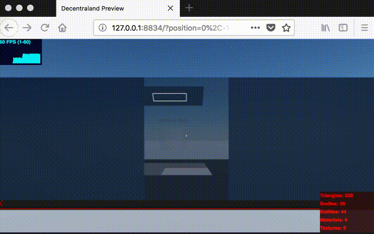

# sample-sync-websockets

This Decentraland scene demonstrates synchronization of state between networked users over websockets. The user should be able to connect and see other users interacting with the scene.

At this time Decentraland isn't rendering the avatars so imagine in this scene the "ghost cylinders" are like a force field around the players while they are in proximity to this scene.

+ See all users moving around the scene
+ Proximity activated tiles
+ Proximity activated door



## How to do this

+ [Docs](./docs/readme.md)
  * [The Build System](./docs/build-system.md)
  * [Synchronize Websockets](./docs/synchronize-websockets.md)
  * [Proximity Activation Technique](./docs/proximity-activation.md)
  * [Deploy to Zeit Now](./docs/host-on-zeit-now.md)

---

## Two parts

The Decentraland **Scene** project is in `./scene`.

The **Server** is in `./server`.

---

## Install

[Install Decentraland CLI app](https://docs.decentraland.org/getting-started/installation-guide/)

```sh
git clone https://github.com/tcrowe/sample-sync-websockets.git
cd sample-sync-websockets

# install scene packages
cd scene
npm install
npm start

# (in another terminal)
# install server packages
cd ../server
npm install
npm start
```

Windows users may require `npm install --ignore-scripts` to avoid compilation.

It's going to bind on two ports:
+ Decentraland preview server `127.0.0.1:8834`
+ Websocket server `127.0.0.1:8835`

Open the preview:

`open http://127.0.0.1:8834`

If you open it in multiple windows you can see the other players in the same scene.

---

## Development

The `./scene` project has these npm scripts:

```sh
# just build and exit
npm run build

# build and watch for changes
npm run watch

# start the preview server which runs also `npm run watch`
npm start
```

The `./server` project has the following npm scripts:

```sh
# watch for changes in development and re-run the server
npm run watch

# run the server in production
npm start
```

Each project contains a `./lib` directory. It's possible to adjust some settings in the following files:

+ [./scene/lib/config.ts](./scene/lib/config.ts)
+ [./server/lib/config.ts](./server/lib/config.ts)

---

## Production

[Publishing the scene on Decentraland](https://docs.decentraland.org/getting-started/publishing/)

To to run the server in production you can `cd server` and `npm start`.

See also [Host on Zeit Now](./docs/host-on-zeit-now.md)

---

## Contribute

If you notice that I've made an affront to correct TypeScript coding practices please forgive.

Others will want to use this as an example or starting place to fork from. If you see room for improvement please fork, mod, and send back here in a PR.

Thank you! 🤗
