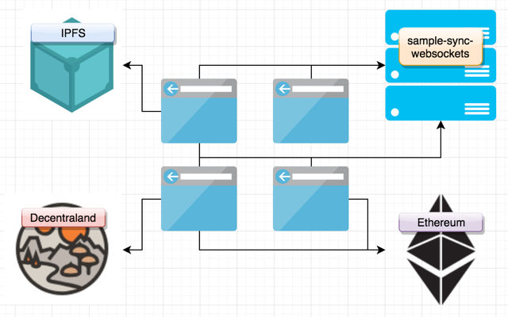

# sample-sync-websockets

This Decentraland scene demonstrates synchronization of state between networked users over websockets. The user should be able to connect and see other users interacting with the scene.

At this time Decentraland isn't rendering the avatars so imagine in this scene the "ghost cylinders" are like a force field around the players while they are in proximity.



---

## Install

+ Install node
  * `brew install node`
  * `choco install nodejs`
  * https://github.com/nodesource/distributions
  * https://github.com/creationix/nvm

```sh
git clone https://github.com/tcrowe/sample-sync-websockets.git
cd sample-sync-websockets
npm install
npm run dev
```

It's going to bind:
+ Decentraland preview server (1) `127.0.0.1:8834`
+ Websocket server cluster (n-CPUs) `127.0.0.1:8835`

Open the preview:

`open http://127.0.0.1:8834`

If you open it in multiple windows you can see the other players in the same scene.

## Development

It runs a bunch of things in parallel:

+ `tslint` (2)
+ `decentraland-compiler` (2)
+ websocker server cluster (n-CPUs)

```sh
npm run dev
```

Or each inidividually:

```sh
# tslint
npm run dev-tslint-scene
npm run dev-tslint-server

# compile with decentraland-compiler
npm run dev-compile-scene
npm run dev-compile-server

# server (6-sec delay waiting for compile)
npm run dev-server

# nuke the build
npm run clean
```

All of `dev-*` tasks watch for changes and re-run themselves.

Configure to your preference:

+ [./tslint.json](./tslint.json)
+ [./.prettierrc](./.prettierrc)
+ [./src/scene/tsconfig.json](./src/scene/tsconfig.json)
+ [./src/server/tsconfig.json](./src/server/tsconfig.json)

**Before commit try running the strict production sequence.**

## Production

Run through all the type and code checks then run the server in production mode.

```sh
npm run prd
```

Or run each part individually.

```sh
# prettier, format all the source files one way
npm run prd-prettier

# lint
npm run prd-tslint-scene
npm run prd-tslint-server

# compile
npm run prd-compile-scene
npm run prd-compile-server

# server (6-sec delay waiting for compile)
npm run prd-server
```

## Contribute

If you notice that I've made an affront to correct TypeScript coding practices please forgive.

Others will want to use this as an example or starting place to fork from. If you see room for improvement please fork, mod, and send back here in a PR.

Before commit `npm run prd` to style check first.

Thank you! 🤗
